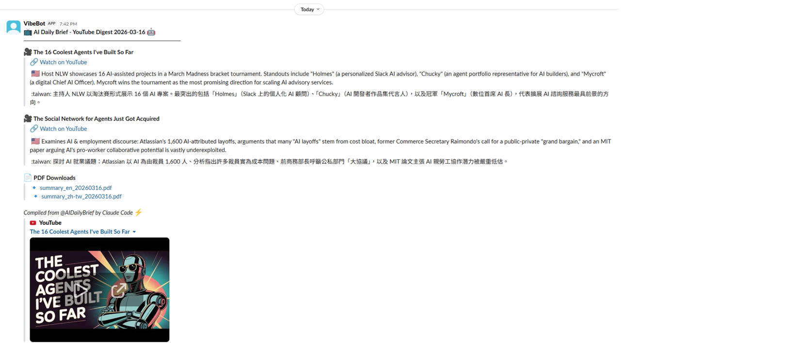

# AI News Digest

[](LICENSE)
[](https://www.python.org/)
[](https://github.com/osisdie/ai-claude-loop/actions)
[](https://github.com/osisdie/ai-claude-loop/commits/main)

Automated daily AI news digest powered by Claude Code's `/loop` feature. Posts bilingual digests (English + Traditional Chinese) to Slack `#update-vibe`.

Two digest types:
- **News Digest** — Web news across 6 AI categories
- **YouTube Digest** — Video summaries from [@AIDailyBrief](https://www.youtube.com/@AIDailyBrief) with PDF exports

## Demo



## Setup

1. Install Python dependencies:
   ```bash
   pip install -r requirements.txt
   ```

2. Install system dependencies:

   | Tool | Purpose | Install |
   |------|---------|---------|
   | `yt-dlp` | Fetch YouTube videos & metadata | `pip install yt-dlp` |
   | `ffmpeg` | Audio extraction for Whisper | [ffmpeg.org](https://ffmpeg.org/download.html) |
   | `google-chrome` | Headless PDF generation | [chrome](https://www.google.com/chrome/) |
   | `b2` | Backblaze B2 CLI for uploads | `pip install b2` |

3. Copy `.env.example` to `.env` and fill in credentials:
   ```bash
   cp .env.example .env
   ```

4. Required environment variables:
   | Variable | Purpose |
   |----------|---------|
   | `SLACK_BOT_TOKEN` | Slack Bot Token (`xoxb-...`) with `chat:write` scope |
   | `SLACK_CHANNEL_ID` | Channel ID for `#update-vibe` |
   | `SLACK_WEBHOOK_URL` | (Optional) Webhook fallback |
   | `B2_KEY_ID` | Backblaze B2 key ID (for YT digest PDF uploads) |
   | `B2_APP_KEY` | Backblaze B2 application key |
   | `B2_BUCKET_NAME` | B2 bucket name (e.g. `claw-dir`) |
   | `HF_TOKEN` | HuggingFace token (Whisper fallback for transcripts) |

5. Invite your Slack bot to `#update-vibe`:
   ```
   /invite @YourBotName
   ```

## Usage

### News Digest

```bash
/ai-news-digest-news           # Run once
/loop 24h /ai-news-digest-news # Run every 24h
```

Searches 6 AI news categories via WebSearch, fetches articles, deduplicates against previous runs, and posts a bilingual summary to Slack.

### YouTube Digest

```bash
/ai-news-digest-yt             # Run once
/loop 24h /ai-news-digest-yt   # Run every 24h
```

Pipeline:
1. Fetch recent videos from @AIDailyBrief (last 48h)
2. Extract transcripts (subtitles → Whisper fallback)
3. Claude generates bilingual summaries (EN + zh-TW)
4. Build HTML → PDF via headless Chrome
5. Upload PDFs to Backblaze B2 (presigned URLs, 7-day expiry)
6. Post digest with summaries + PDF links to Slack

## Project Structure

```
.claude/commands/
  ai-news-digest-news.md        — News digest slash command
  ai-news-digest-yt.md          — YouTube digest slash command

scripts/
  slack_notify.sh                — Slack posting (Bot Token + webhook fallback)
  yt/
    fetch_recent_videos.py       — List recent videos (yt-dlp + date filter + dedup)
    get_transcript.py            — Extract transcript (subs → Whisper fallback)
    build_html.py                — Markdown → styled HTML
    build_pdf.py                 — HTML → PDF (headless Chrome)
    upload_b2.py                 — Upload to B2, returns presigned URL

digest-news/YYYY-MM-DD/         — News digest backups (gitignored)
digest-yt/YYYY-MM-DD/           — YT digest outputs (gitignored)
.state/                          — Dedup state files (gitignored)
```

## News Categories

| Emoji | Category |
|-------|----------|
| 🧠 | LLM / Foundation Models |
| 📦 | AI Products & Applications |
| ⚖️ | AI Policy & Regulation |
| 🔬 | AI Research Papers |
| 💼 | Industry & Business |
| 🔓 | Open Source AI |

## Limitations

- `/loop` has a max duration of ~3 days — restart periodically
- WebSearch availability may vary by region
- Slack messages auto-split if exceeding ~4000 char limit
- B2 presigned URLs expire after 7 days by default
